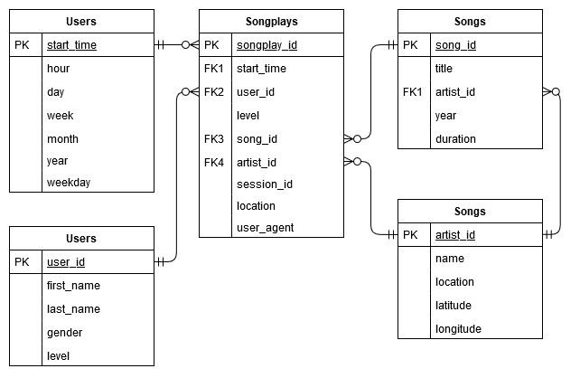

# Sparkify PostgreSQL ETL

This repository contains the first project submission for the Udacity Data Engineering Nanodegree. The project introduces the following concepts:
* Data modeling with [Postgres](https://www.postgresql.org/)
* Using a [Database star schema](https://en.wikipedia.org/wiki/Star_schema)
* Building an ETL pipeline using [Python](https://www.python.org/)

A project introduction can be found [here](./INTRODUCTION.md).

# Context 

A startup called Sparkify wants to analyze the data they've been collecting on songs and user activity on their new music streaming app. The analytics team is particularly interested in understanding what songs users are listening to. Currently, they don't have an easy way to query their data, which resides in a directory of JSON logs on user activity on the app, as well as a directory with JSON metadata on the songs in their app.

The database created serves the purpose of housing the data that currently is only available through collected log files. The tables in the database serves to map the relation between the user activity and the song and artists being listened to.

Such a database design should allow Sparkifys analytical team to easily see relations between user activity and songs, and thus give a better understand of their users listening habits. 

# Schema Design

> State and justify your database schema design and ETL pipeline.

For this exercise, a Star Schema is being used: A single main fact table containing measures for user activities (song plays) and related dimensional tables (songs, artists, users and time), each containing dimension keys, values and attributes related to the dimension.

The reasoning for using a Star Schema with facts and dimensions is to seperate measurable, quantitative data (in the fact) and descriptive attributes related to this fata (in the dimensions). 

Furthermore, we know the structure of the JSON files, and how to extract data from these, making a relational database suitable for this type of workflow, and the data needed to answer business questions described in the previous section can be modeled using ERD models. 

# ETL Pipeline

> State and justify your database schema design and ETL pipeline.

TODO

# Examples

> [Optional] Provide example queries and results for song play analysis.

TODO

