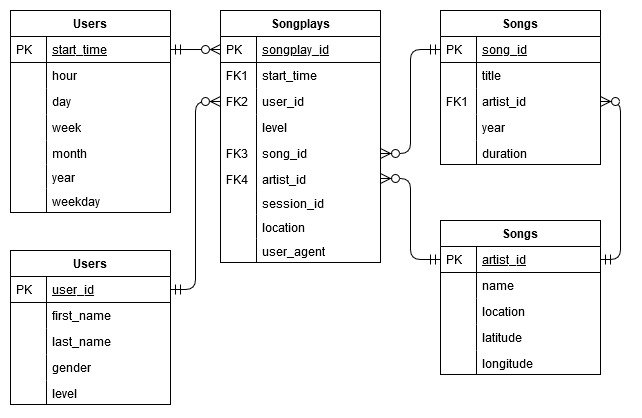

# Sparkify PostgreSQL ETL

This repository contains the first project submission for the Udacity Data Engineering Nanodegree. The project introduces the following concepts:
* Data modeling with [Postgres](https://www.postgresql.org/)
* Using a [Database star schema](https://en.wikipedia.org/wiki/Star_schema)
* Building an ETL pipeline using [Python](https://www.python.org/)

A project introduction can be found [here](./INTRODUCTION.md).


# Context 

A startup called Sparkify wants to analyze the data they've been collecting on songs and user activity on their new music streaming app. The analytics team is particularly interested in understanding what songs users are listening to. Currently, they don't have an easy way to query their data, which resides in a directory of JSON logs on user activity on the app, as well as a directory with JSON metadata on the songs in their app.

The database created serves the purpose of housing the data that currently is only available through collected log files. The tables in the database serves to map the relation between the user activity and the song and artists being listened to.

Such a database design should allow Sparkifys analytical team to easily see relations between user activity and songs, and thus give a better understand of their users listening habits. 


# Schema Design

For this exercise, a Star Schema is being used: A single main fact table containing measures for user activities (song plays) and related dimensional tables (songs, artists, users and time), each containing dimension keys, values and attributes related to the dimension.

The reasoning for using a Star Schema with facts and dimensions is to seperate measurable, quantitative data (in the fact) and descriptive attributes related to this fata (in the dimensions). 

Furthermore, we know the structure of the JSON files, and how to extract data from these, making a relational database suitable for this type of workflow, and the data needed to answer business questions described in the previous section can be modeled using ERD models. 




# ETL Pipeline

The ETL process ([etl.py](./etl.py)) consists of the following steps:

1. The program runs trough the songs folder and finds all *.json files, to be selected for processing
2. For each *.json file in the list, the program loads the data into a Pandas dataframe
3. From this dataframe, song data is extracted and inserted into the songs database table, followed by artist information extraction and insertion into the artist table.
4. The program then runs trough the logs folder and finds all *.json files, to be selected for processing
5. For each *.json file in the list, the program loads the data into a Pandas dataframe
6. From this dataframe, each row of data is extracted if the page is 'NextSong' (otherwise ignored).
7. From each row of information, time data is extracted and inserted into the time table, followed by the same process for user data.
8. Finally, for each row, after inserting to time and users table, artist_id and song_id information is loaded from the database (based on song title, artist name and song duration), and the full measures for user activities is inserted into the main fact table: songplays.


# Examples

> [Optional] example queries and results for song play analysis.


```sql
/* Get most overall active users in terms of playcount */
SELECT user_id, count(user_id)
FROM songplays
GROUP BY user_id
ORDER BY count(user_id) DESC
LIMIT 10
```

```sql
/* Get most overall active users in terms of playcount, for paid users */
SELECT user_id, count(user_id)
FROM songplays
WHERE level = 'paid'
GROUP BY user_id
ORDER BY count(user_id) DESC
LIMIT 10
```

```sql
/* Get most overall active users in terms of playcount, within a single session */
SELECT user_id, count(session_id), session_id
FROM songplays
GROUP BY user_id, session_id
ORDER BY count(session_id) DESC
LIMIT 10
```