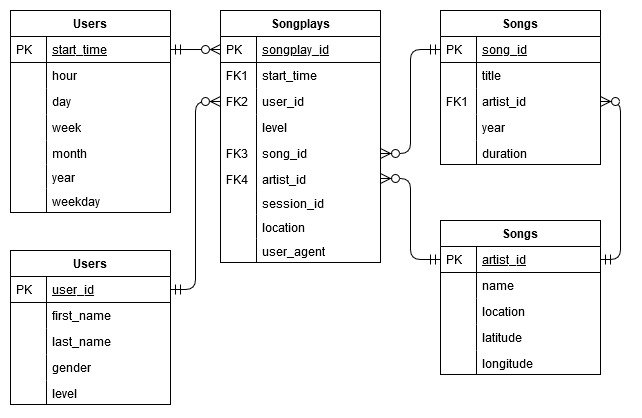

# Sparkify PostgreSQL ETL

This repository contains the first project submission for the Udacity Data Engineering Nanodegree. The project introduces the following concepts:
* Data modeling with [Postgres](https://www.postgresql.org/)
* Using a [Database star schema](https://en.wikipedia.org/wiki/Star_schema)
* Building an ETL pipeline using [Python](https://www.python.org/)

A project introduction can be found [here](./INTRODUCTION.md).


# Context 

The startup Sparkify wants to analyze song and user activity data collected from their new music streaming app. They are interested in gaining insights into what song users are listening to. Currently this information is stored in JSON log files seperated into a directory for songs, and one for user activity logs.
The database created serves the purpose of housing the data that currently is only available through these collected log files. The tables in the database serves to map the relation between the user activity and the song and artists being listened to.

Such a database design should allow Sparkifys analytical team to easily see relations between user activity and songs, and thus give a better understand of their users listening habits. 


# Project Structure

## Main files used in the project:

|Filename|Description|
|---|---|
|[assets](./assets/)|Assets folder containing assets for markdown presentation|
|[data](./data/)|Main data folder containing song and log data used for the ETL process|
|[create_tables.py](./create_tables.py)|Python script for re-creating the main database and tables used in this excersice|
|[etl.ipynb](./etl.ipynb)|A notebook containing the sample code for developing the data models as well as the ETL process|
|[etl.py](./etl.py)|The final version of the ETL process created in [etl.ipynb](./etl.ipynb)|
|[INTRODUCTION.md](./INTRODUCTION.md)|Introduction to the projects as presented by Udacity|
|[README.md](./README.md)|This file, descriping the repository and the content|
|[sql_queries.py](./sql_queries.py)|The SQL queries for dropping and creating the tables, as well as inserting into and selecting from the tables for the ETL process|
|[test.ipynb](./test.ipynb)|A testing notebook for making sure the ETL process is working|

## Support/Utility files used in the project:

|Filename|Description|
|---|---|
|[demo](./demo/)|A folder containing demo code from the study material presented by Udacity|
|[example_queries.ipynb](./example_queries.ipynb)|A notebook containing example queries for how to query the database for song and log information|
|[exmploring_data.ipynb](./exmploring_data.ipynb)|A notebook containing the sample code for exploring the relations between artists in song and log files|
|[zip_workspace.ipynb](./zip_workspace.ipynb)|A supporting notebook containing code to compress this workspace into a single zip file for easy downloading the repository from the workspace|


# Schema Design

For this exercise, a Star Schema is being used: A single main fact table containing measures for user activities (song plays) and related dimensional tables (songs, artists, users and time), each containing dimension keys, values and attributes related to the dimension.

The reasoning for using a Star Schema with facts and dimensions is to seperate measurable, quantitative data (in the fact) and descriptive attributes related to this fata (in the dimensions). 

Furthermore, we know the structure of the JSON files, and how to extract data from these, making a relational database suitable for this type of workflow, and the data needed to answer business questions described in the previous section can be modeled using ERD models. 




# ETL Pipeline

The ETL process ([etl.py](./etl.py)) consists of the following steps:

1. The program runs trough the songs folder and finds all *.json files, to be selected for processing
2. For each *.json file in the list, the program loads the data into a [pandas series](https://pandas.pydata.org/pandas-docs/stable/reference/api/pandas.Series.html)
3. From this dataframe, song data is extracted and inserted into the songs database table, followed by artist information extraction and insertion into the artist table
4. The program then runs trough the logs folder and finds all *.json files, to be selected for processing
5. For each *.json file in the list, the program loads the data into a [Pandas dataframe](https://pandas.pydata.org/pandas-docs/stable/reference/api/pandas.DataFrame.html)
6. From this dataframe, each row of data is extracted if the page is 'NextSong' (otherwise ignored)
7. From each row of information, time data is extracted and inserted into the time table, followed by the same process for user data
8. Finally, for each row, after inserting to time and users table, artist_id and song_id information is loaded from the database (based on song title, artist name and song duration), and the full measures for user activities is inserted into the main fact table: songplays


# How to run 

Using the terminal/console from the root directory, type:

```sh
python create_tables.py
```

This connects to the default 'studentdb' database, and drops any existing database 'sparkifydb' if one exists, and creates a new one of that name. 
It then disconnects from 'studentdb' and connects to 'sparkifydb', where it drops all tables for the facts and dimensions described in [sql_queries.py](./sql_queries.py), and re-creates the tables from the create statements in [sql_queries.py](./sql_queries.py), and closes the connection.

Once this completes successfully, the ETL process can be run by typing:

```sh
python etl.py
```

This connects to the 'sparkifydb' database, and loops through the song files in './data/song_data/' followed by the log files in './data/log_data/', extracts song and log data, and inserts this information into the fact and dimensional tables.

Here the console will inform of the ETL process, how many song and log files have been processed.


# Example queries

> [Optional] example queries and results for song play analysis.


```sql
/* Get most overall active users in terms of playcount */
SELECT user_id, count(user_id)
FROM songplays
GROUP BY user_id
ORDER BY count(user_id) DESC
LIMIT 10
```

```sql
/* Get most overall active users in terms of playcount, for paid users */
SELECT user_id, count(user_id)
FROM songplays
WHERE level = 'paid'
GROUP BY user_id
ORDER BY count(user_id) DESC
LIMIT 10
```

```sql
/* Get most overall active users in terms of playcount, within a single session */
SELECT user_id, count(session_id), session_id
FROM songplays
GROUP BY user_id, session_id
ORDER BY count(session_id) DESC
LIMIT 10
```

```sql
/* Get user and session information for all listens where artist and song are related in fact and dimensional tables */
SELECT 
    sp.user_id,
    sp.session_id,
    u.first_name,
    u.last_name,
    u.level,
    a.name,
    s.title,
    s.duration,
    to_char(to_timestamp(t.start_time / 1000), 'DD Mon YYYY HH24:MI:SS') as start_time
FROM songplays sp
LEFT JOIN songs s ON s.song_id = sp.song_id
LEFT JOIN artists a ON a.artist_id = sp.artist_id
LEFT JOIN users u ON u.user_id = sp.user_id
LEFT JOIN time t ON t.start_time = sp.start_time
WHERE sp.artist_id IS NOT NULL 
    AND sp.song_id IS NOT NULL
```