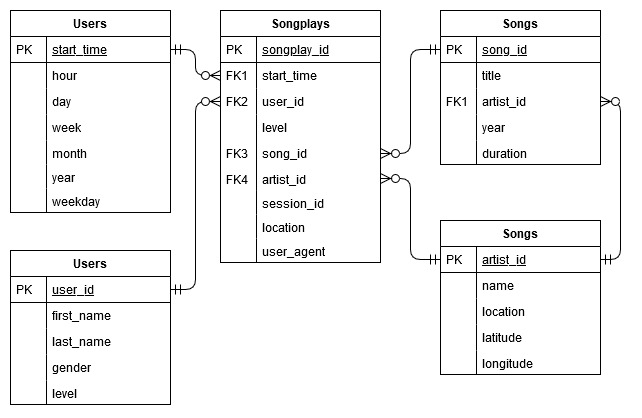

# Sparkify Amazon Redshift ETL

This repository contains the project submission for the Udacity Data Engineering Nanodegree. The project introduces the following concepts:
* Data modeling with [Amazon Redshift](https://aws.amazon.com/redshift/)
* Building an ETL pipeline using [Python](https://www.python.org/)


# Context 

A music streaming startup, Sparkify, has grown their user base and song database and want to move their processes and data onto the cloud. Their data resides in S3, in a directory of JSON logs on user activity on the app, as well as a directory with JSON metadata on the songs in their app.

In this project, we will need to load data from S3 to staging tables on Redshift and execute SQL statements that create the analytics tables from these staging tables.


# Project Structure

## Main files used in the project:

|Filename|Description|
|---|---|
|[assets](./assets/)|Assets folder containing assets for markdown presentation|
|[create_tables.py](./create_tables.py)|Python script for re-creating the main database and tables used in this excersice|
|[dwh.cfg](./dwh.cfg)|Config file containing the information for how to connect to AWS and use the created the Redshift cluster|
|[etl.py](./etl.py)|Python script for the ETL process of loading from S3, staging and transforming the data|
|[README.md](./README.md)|This file, descriping the repository and the content|
|[sql_queries.py](./sql_queries.py)|The SQL queries for dropping and creating the tables, as well as inserting into and selecting from the tables for the ETL process|


## Support/Utility files used in the project:

|Filename|Description|
|---|---|
|[demo](./demo/)|A folder containing demo code from the study material presented by Udacity|
|[dwh-iac.cfg](./dwh-iac.cfg)|Config file containing the information for how to connect to AWS and setup the Redshift cluster|
|[redshift-cluster-iac-create.py](./redshift-cluster-iac-create.py)|Python script for setting up the Redshift cluster infrastructure as code|
|[redshift-cluster-iac-destroy.py](./redshift-cluster-iac-destroy.py)|Python script for tearing down the Redshift cluster infrastructure as code|
|[redshift-cluster-iac-samples.ipynb](./redshift-cluster-iac-samples.ipynb)|A notebook containing example code for setting up the Redshift cluster infrastructure as code|
|[sql_queries-samples.ipynb](./sql_queries-samples.ipynb)|A notebook containing the sample code for exploring the imported staging and analytics data|
|[zip_workspace.ipynb](./zip_workspace.ipynb)|A supporting notebook containing code to compress this workspace into a single zip file for easy downloading the repository from the workspace|


# Schema Design

The data from S3 is loaded into two main staging tables before being transformed and loaded into analytics fact and dimentional tables.

### Staging Tables

* staging_events: *artist, auth, firstName, gender, itemInSession, lastName, length, level, location, method, page, registration, sessionId, song, status, ts, userAgent, userId*
* staging_songs: *num_songs, artist_id, artist_latitude, artist_longitude, artist_location, artist_name, song_id, title, duration, year*

### Analytics tables

For the analytics tables, a Star Schema is being used: A single main fact table containing measures for user activities (songplays) and related dimensional tables (songs, artists, users and time), each containing dimension keys, values and attributes related to the dimension.

This separates measurable, quantitative data (in the fact) and descriptive attributes related to this data (in the dimensions). 




# How to run 

### Setup Configurations

Setup the dwh.cfg file with information on how to connect, as well as the IAM role.

```ini
[CLUSTER]
HOST=''
DB_NAME=''
DB_USER=''
DB_PASSWORD=''
DB_PORT=5439

[IAM_ROLE]
ARN=''

[S3]
LOG_DATA='s3://udacity-dend/log_data'
LOG_JSONPATH='s3://udacity-dend/log_json_path.json'
SONG_DATA='s3://udacity-dend/song_data'
```

### Create tables

Using the terminal/console, run the create_tables script:

```sh
python create_tables.py
```

This connects to the Redshift cluster, where it drops all tables for the staging, fact and dimensional tables described in [sql_queries.py](./sql_queries.py), and re-creates the tables from the create statements in [sql_queries.py](./sql_queries.py), and closes the connection.


### Load data

Using the terminal/console, run the etl script:

```sh
python etl.py
```

This connects to the Redshift cluster, and loads in data from S3 into staging tables, transforms and inserts this information into the fact and dimensional tables.
