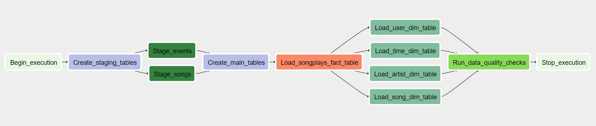

# Sparkify Data Pipelines with Airflow

This repository contains the project submission for the Udacity Data Engineering Nanodegree. The project introduces the following concepts:
* Building a data pipeline using [Apache Airflow](https://airflow.apache.org/)
* Loading data for processing from [Amazon S3](https://aws.amazon.com/S3/) and saving processed data to [Amazon Redshift](https://aws.amazon.com/redshift/)
* Loading Airflow and running the DAG locally through [Docker](https://www.docker.com/)


# Context 

A music streaming company, Sparkify, has decided that it is time to introduce more automation and monitoring to their data warehouse ETL pipelines and come to the conclusion that the best tool to achieve this is Apache Airflow. They have also noted that the data quality plays a big part when analyses are executed on top the data warehouse and want to run tests against their datasets after the ETL steps have been executed to catch any discrepancies in the datasets.

In this project, we will need to load data from S3, process the data into analytics tables on Redshift, and verify data integrety using tests. We implement this process using Apache Airflow.


# Project Structure

## Main files used in the project:

|Filename|Description|
|---|---|
|[assets](./assets/)| Assets folder containing images displayed in the readme |
|[dags](./dags/)| Folder containing DAGs used by Airflow |
|[plugins](./plugins/)| Folder containing plugins used by Airflow |
|[README.md](./README.md)| This file, descriping the repository and the content |

## Support/Utility files used in the project:

|Filename|Description|
|---|---|
|[demo](./demo/)| Folder containing demo code from the study material presented by Udacity |
|[create_tables.py](./create_tables.py)| Supporting SQL scripts from Udacity for creating tables needed to complete the project. These have been repurposed and migrated to [/plugins/helpers/sql_queries.py](./plugins/helpers/sql_queries.py)  |
|[create-fernet-key.py](./create-fernet-key.py)| Supporting Python script that creates a fernet key to be used for encryption of Airflow Connection passwords across Airflow instances and reboots |
|[docker-compose.yml](./docker-compose.yml)| Docker Compose file for launching Airflow in a docker container for local development and testing |
|[requirements.txt](./requirements.txt)| Required python libraries that should be installed in the docker container along with airflow. Connection to this file is setup in [docker-compose.yml](./docker-compose.yml) |


# How to run 

## Execute locally

### Setup Configurations 

1) Make sure you have docker with docker-compose installed locally
2) Make sure you have a running Redshift cluster on AWS
2) Run ```docker-compose up``` from this folder using your favorite terminal
3) Create Redshift and AWS Connections strings in Airflow:
    * AWS Connection: 
        * Conn Id: Enter ```aws_credentials```
        * Conn Type: Enter ```Amazon Web Services```
        * Login: Enter your Access key ID
        * Password: Enter your Secret access key
    * Redshift Connection: 
        * Conn Id: Enter ```redshift```
        * Conn Type: Enter ```Postgres```
        * Host: Enter the endpoint of your Redshift cluster, excluding the port
        * Schema: Enter your preffered Redshift schema (e.g. dev)
        * Login: Enter your Redshift username.
        * Password: Enter the password you created when launching your Redshift cluster.
        * Port: Enter 5439.

### Running

1) Go to ```http://localhost:8080/admin/``` in your browser
2) Enable ```sparkify_dag``` and it will auto-start


# ETL Pipeline

## Overview of Airflow pipeline:



## Loading data from S3

The process reads song and log data from S3, using the specifiers: 

* Song data: s3://udacity-dend/song_data
* Log data: s3://udacity-dend/log_data

## Data Processing

Data loaded from S3 is processed and transformed into five main Fact and Dimensional tables in your Redshift cluster:

| Table | Columns |
| --- | --- |
| songplays | *songplay_id, start_time, user_id, level, song_id, artist_id, session_id, location, user_agent* |
| users | *user_id, first_name, last_name, gender, level* |
| songs | *song_id, title, artist_id, year, duration* |
| artists | *artist_id, name, location, lattitude, longitude* |
| time | *start_time, hour, day, week, month, year, weekday* |

## Quality Checks

Two checks are made during the quality checks for each table:

1) Checking that there are valid data in main tables
    * ```SELECT COUNT(*) FROM {table}``` should return > 0
2) Checking that there are no invalid data in main tables
    * ```SELECT COUNT(*) FROM {table} WHERE {table_id} IS NULL``` should return <= 0  

